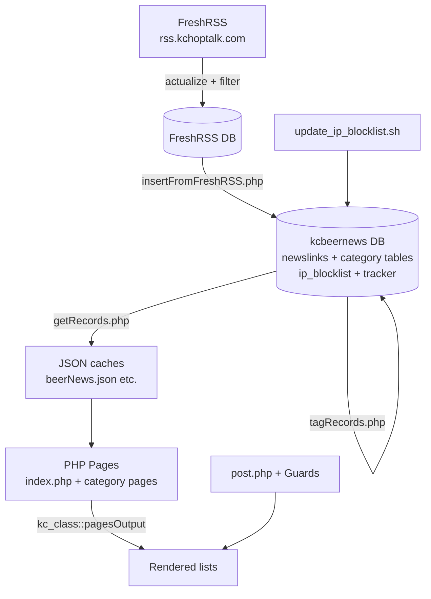

# KC Hop Talk (kchoptalk.com)

**Content curation for craft beer and brewing news, automated over 14 years.**

Live site: [https://kchoptalk.com](https://kchoptalk.com)

---

## What This Is

KC Hop Talk is a long-running, solo-developed site that aggregates, filters, categorizes, and presents beer news, jobs, reviews, recipes, "cook with beer" articles, how-tos, and new releases.

It started as manual curation and evolved into a fully automated pipeline because the manual steps became unsustainable. The code reflects real-world iteration: early scraping experiments were abandoned in favor of leveraging (then self-hosting) feed readers + custom ETL + JSON caching + lightweight PHP presentation.

Significant engineering time over the last several years has gone into **defending the site** against scanners, SQLi attempts, bots, and abuse — a practical showcase of production hardening for a public content site.

## Current Architecture (2025–2026)

**Active automation (DreamHost crons):**

- `cron/feedFilter.cron` — Orchestrates the pipeline:
  - `php/insertFromFreshRSS.php` — Pulls beer-relevant unread items from FreshRSS DB (title keyword match), inserts to main DB, marks junk read.
  - `php/tagRecords.php` — Keyword-based categorization into dedicated tables (jobs, reviews, recipes, howto, cooking, traders).
  - `php/getRecords.php` — Exports recent items per category to JSON.
- `rss.kchoptalk.com/app/actualize_script.php` (or FreshRSS CLI) — Refreshes subscribed feeds.
- `update_ip_blocklist.sh` — Downloads community IPv4 blocklist (Data-Shield), loads into `ip_blocklist` table via `LOAD DATA`.

**Frontend:**
- Classic PHP + Bootstrap (mixed 3/4 era) + custom CSS.
- Server-rendered lists from JSON.
- Encoded redirect handling in `post.php` (with guards).
- Basic security headers, CSP with nonces, early IP block checks.

**Data:**
- MariaDB (`kcbeernews`).
- Separate FreshRSS DB.
- Keywords table drives tagging (simple but effective).
- Heavy deduping + age limits.

## Tech Stack & Skills Demonstrated

- **PHP** (long-running, procedural + classes, PDO, CLI scripts for cron)
- **Self-hosted RSS** (FreshRSS fork/customized deployment)
- **ETL / data pipeline** design (filter → tag → export)
- **Keyword-driven curation** + deduplication logic
- **Security engineering**: IP reputation, attack signature detection (SecurityGuard), URL guards, logging, early-exit blocks, blocklist automation, defensive filename placeholders
- **Caching strategy** (JSON files for fast static-like delivery)
- **Legacy integration & migration** (Feedly → FreshRSS, Buffer remnants)
- **Ops**: Crontab orchestration, remote DB loading, shell scripts

## Project Layout (High Level)

| Path              | Purpose                              | Status      |
|-------------------|--------------------------------------|-------------|
| `*.php` (root)    | Category pages + post.php            | Active      |
| `php/`            | Core classes, filters, guards, DB    | Mixed       |
| `cron/`           | Shell wrappers for pipeline          | Mostly legacy except feedFilter |
| `json/`           | Generated data + archives            | Active + huge legacy |
| `css/` / `js/`    | Styles & minimal interactivity       | Dated       |
| `fest/`           | Historical KC beer fest archives (2014–2019) | Archive   |
| `sql/`            | Schema + migration queries           | Reference   |
| `logs/`           | Error + security attempt logs        | Ops         |
| `rss.kchoptalk.com/` | Full FreshRSS instance            | Active      |

## History (Condensed)

- ~2011–2012: Manual curation + basic scraping experiments.
- Feedly + Buffer era: API-driven discovery and social distribution.
- Anti-hacker years: Constant cat-and-mouse (visible in `logs/hackers*`).
- Recent: Replaced Feedly ingestion with self-hosted FreshRSS + custom `insertFromFreshRSS` / tagging pipeline. Buffer posting largely retired.

Many experiments and one-off tools remain in the tree — a realistic artifact of iterative solo development.

## Getting Started (Local / Dev)

The code expects:
- PHP 7.3+ (production uses php73 on DreamHost; modernize recommended)
- MariaDB/MySQL access (creds via `~/.dbu` JSON or similar)
- FreshRSS instance (optional for full pipeline)
- Web server

**Warning:** Many hard-coded paths (`/home/jambra49/...`). Update before running.

Common entry points:
- `index.php` — Main news
- `jobs.php`, `reviews.php`, `recipes.php`, etc.
- CLI: `php php/insertFromFreshRSS.php Y REMOTE` etc.

## Security Notes

- Early IP block + tracker checks on every page load.
- Community blocklist auto-refreshed.
- Attack logging is extensive (valuable dataset).
- Defensive filename placeholders for common webshell names (`c99shell.php`, `bbb.php`) — these contain only a comment explaining they are intentional blocks to stop real malicious uploads.
- Post.php uses custom redirect encoding + guards.
- SecurityGuard and URLRedirectGuard classes for input/attack detection.

## Contributing / Status

This is primarily a personal project and living archive of curation automation. PRs for cleanup, modernization, or useful features welcome on the GitHub mirror.

---

## Roadmap

See [ROADMAP.md](ROADMAP.md) for phased development plan focused on:
1. Hygiene, archival of dead code, security cleanup.
2. Modernization of pipeline and data layer.
3. Frontend refresh + better UX.
4. New features (search, newsletters, etc.).
5. Ops, Docker, CI, showcase polish.

The goal is to turn this into both a reliable beer news resource **and** a clean demonstration of thoughtful, battle-tested web engineering.
